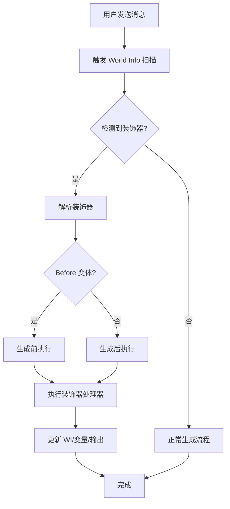

# 装饰器详细文档

本文档详细介绍 ST-CustomGeneration 扩展提供的所有装饰器，包括语法、参数、使用场景和完整示例。

## 目录

- [装饰器概述](#装饰器概述)
- [工作原理](#工作原理)
- [通用语法](#通用语法)
- [内容替换装饰器](#内容替换装饰器)
  - [@@replace](#replace)
  - [@@replace_diff](#replace_diff)
  - [@@replace_search](#replace_search)
  - [@@replace_ejs](#replace_ejs)
- [变量更新装饰器](#变量更新装饰器)
  - [@@variables_json](#variables_json)
  - [@@variables_yaml](#variables_yaml)
  - [@@variables_jsonpatch](#variables_jsonpatch)
- [输出追加装饰器](#输出追加装饰器)
  - [@@append_output](#append_output)
  - [@@append_output_ejs](#append_output_ejs)
- [代码执行装饰器](#代码执行装饰器)
  - [@@evaluate_ejs](#evaluate_ejs)
- [辅助装饰器](#辅助装饰器)
  - [@@batch_order](#batch_order)
- [装饰器组合使用](#装饰器组合使用)
- [最佳实践](#最佳实践)

---

## 装饰器概述

装饰器是 World Info 条目中的特殊标记，用于触发各种后处理操作。通过在 World Info 条目内容的开头添加装饰器，可以实现：

- **动态更新 WI 内容** - 根据生成结果自动更新 World Info
- **变量存储与管理** - 存储和更新状态变量
- **输出追加** - 在 AI 回复末尾追加额外内容
- **代码执行** - 运行自定义 EJS 代码

### 支持的装饰器列表

| 装饰器 | 功能 | 执行时机 |
|--------|------|----------|
| `@@replace` | 直接替换 WI 内容 | 生成后 |
| `@@replace_diff` | Git Diff 格式更新 | 生成后 |
| `@@replace_search` | 搜索替换文本 | 生成后 |
| `@@replace_ejs` | EJS 模板替换 | 生成后 |
| `@@variables_json` | JSON Merge Patch 更新变量 | 生成后 |
| `@@variables_yaml` | YAML Merge Patch 更新变量 | 生成后 |
| `@@variables_jsonpatch` | JSON Patch 更新变量 | 生成后 |
| `@@append_output` | 追加内容到消息末尾 | 生成后 |
| `@@append_output_ejs` | EJS 模板追加 | 生成后 |
| `@@evaluate_ejs` | 执行 EJS 代码 | 生成后 |

---

## 工作原理

### 执行流程



### Before/After 变体

每个装饰器都有两种执行时机：

| 变体 | 执行时机 | 用途 |
|------|----------|------|
| `@@decorator` | AI 生成后 | 处理 AI 的生成结果 |
| `@@decorator_before` | AI 生成前 | 预处理 WI 内容 |

例如：
- `@@replace` - 在 AI 生成后执行替换
- `@@replace_before` - 在 AI 生成前执行替换

### 触发条件

装饰器的触发需要满足以下条件：

1. World Info 条目已启用
2. 条目的触发关键词被匹配
3. 装饰器语法正确
4. 模板配置正确（如需要）

---

## 通用语法

### 基本格式

```
@@装饰器名称 参数1 参数2 "带空格的参数"
内容
```

### 参数格式

参数支持以下格式：

| 格式 | 示例 | 说明 |
|------|------|------|
| 无参数 | `@@replace` | 不需要额外参数 |
| 单个参数 | `@@replace tag1` | 空格分隔的参数 |
| 带引号参数 | `@@replace "tag with space"` | 包含空格的参数需要引号 |
| 多个参数 | `@@replace tag1 tag2` | 多个参数用空格分隔 |

### 转义

如果内容以 `@@` 开头但不是装饰器，可以使用 `@@@` 转义：

```
@@@这不是装饰器，是普通文本
```

---

## 内容替换装饰器

### @@replace

直接替换 World Info 条目的内容。

#### 语法

```
@@replace [tag]
新内容
```

#### 参数

| 参数 | 必需 | 说明 |
|------|------|------|
| tag | 否 | 模板标签，用于匹配特定模板 |

#### 使用场景

- 完全替换 WI 条目内容
- 更新角色状态描述
- 记录简单信息

#### 示例

**基本用法：**

```
@@replace
角色当前心情：开心
位置：花园
```

**带标签用法：**

```
@@replace mood
心情：愤怒
```

#### 工作原理

1. AI 生成新内容
2. 模板处理生成结果（如配置了匹配正则）
3. 新内容完全替换原 WI 内容
4. 覆盖记录保存在消息的 `swipe_info` 中

---

### @@replace_diff

使用 Git Diff（Unified Diff）格式更新 WI 内容。

#### 语法

```
@@replace_diff [tag]
--- original
+++ modified
@@ -1,2 +1,2 @@
-old line
+new line
```

#### 参数

| 参数 | 必需 | 说明 |
|------|------|------|
| tag | 否 | 模板标签 |

#### 使用场景

- 精确修改 WI 内容的特定部分
- 保留大部分内容，只修改少量文本
- 需要精确控制修改范围的场景

#### 示例

```
@@replace_diff
--- a/content.txt
+++ b/content.txt
@@ -1,3 +1,3 @@
 角色名称：Alice
-心情：开心
+心情：兴奋
 位置：花园

```

#### 工作原理

1. 获取当前 WI 内容
2. 应用 Diff 补丁
3. 更新 WI 内容

> ⚠️ **注意**：Diff 格式需要精确匹配原内容，否则可能应用失败。

---

### @@replace_search

使用搜索替换模式更新 WI 内容。

#### 语法

```
@@replace_search [tag]
搜索文本|||替换文本

```

#### 参数

| 参数 | 必需 | 说明 |
|------|------|------|
| tag | 否 | 模板标签 |

#### 分隔符

使用 `|||` 作为搜索文本和替换文本的分隔符。

#### 使用场景

- 简单的文本替换
- 更新特定字段值
- 修改关键词

#### 示例

**替换单个文本：**

```
@@replace_search
开心|||兴奋

```

**替换多个文本（需要多次调用）：**

```
@@replace_search
心情：开心|||心情：兴奋

```

#### 工作原理

1. 在 WI 内容中搜索指定文本
2. 将找到的文本替换为新文本
3. 更新 WI 内容

---

### @@replace_ejs

使用 EJS 模板生成替换内容。

#### 语法

```
@@replace_ejs [tag]
<%= expression %>

```

#### 参数

| 参数 | 必需 | 说明 |
|------|------|------|
| tag | 否 | 模板标签 |

#### 可用变量

在 EJS 模板中可以访问以下变量：

| 变量 | 类型 | 说明 |
|------|------|------|
| `variables` | Object | 当前存储的变量 |
| `char` | Object | 角色信息 |
| `user` | Object | 用户信息 |
| `message` | String | 当前消息内容 |
| `lastUserMessage` | String | 最后一条用户消息 |
| `lastCharMessage` | String | 最后一条角色消息 |
| `original` | String | 原始 WI 内容 |
| `current` | String | 当前 WI 内容（可能已被覆盖） |

#### 使用场景

- 动态生成 WI 内容
- 基于变量构建复杂文本
- 条件性内容生成

#### 示例

**基本用法：**

```
@@replace_ejs
角色状态报告：
心情：<%= variables.mood || '未知' %>
位置：<%= variables.location || '未知' %>
时间：<%= new Date().toLocaleTimeString() %>

```

**条件判断：**

```
@@replace_ejs
<% if (variables.mood === '开心') { %>
角色正在微笑，看起来很愉快。
<% } else { %>
角色的表情有些复杂。
<% } %>

```

---

## 变量更新装饰器

### @@variables_json

使用 JSON Merge Patch 格式更新变量。

#### 语法

```
@@variables_json [tag]
{
  "key": "value",
  "nested": {
    "property": "updated"
  }
}

```

#### 参数

| 参数 | 必需 | 说明 |
|------|------|------|
| tag | 否 | 模板标签 |

#### 使用场景

- 存储结构化数据
- 更新角色状态
- 记录对话信息

#### 示例

**基本用法：**

```
@@variables_json
{
  "mood": "开心",
  "energy": 80,
  "location": "花园"
}

```

**嵌套对象：**

```
@@variables_json
{
  "stats": {
    "health": 100,
    "mana": 50
  },
  "inventory": ["剑", "盾牌"]
}

```

#### 工作原理

使用 JSON Merge Patch (RFC 7396) 合并到现有变量：

- 新键会被添加
- 已有键会被更新
- 值为 `null` 的键会被删除
- 数组会被完全替换（不会合并）

---

### @@variables_yaml

使用 YAML 格式更新变量。

#### 语法

```
@@variables_yaml [tag]
key: value
nested:
  property: updated

```

#### 参数

| 参数 | 必需 | 说明 |
|------|------|------|
| tag | 否 | 模板标签 |

#### 使用场景

- 更易读的变量格式
- 复杂嵌套结构
- 需要注释的场景

#### 示例

```
@@variables_yaml
mood: 开心
energy: 80
location: 花园
stats:
  health: 100
  mana: 50
inventory:
  - 剑
  - 盾牌

```

#### 工作原理

YAML 内容会被解析并转换为 JSON，然后使用 Merge Patch 合并。

---

### @@variables_jsonpatch

使用 JSON Patch (RFC 6902) 格式精确更新变量。

#### 语法

```
@@variables_jsonpatch [tag]
[
  { "op": "add", "path": "/newKey", "value": "newValue" },
  { "op": "replace", "path": "/existingKey", "value": "updatedValue" },
  { "op": "remove", "path": "/oldKey" }
]

```

#### 参数

| 参数 | 必需 | 说明 |
|------|------|------|
| tag | 否 | 模板标签 |

#### 支持的操作

| 操作 | 说明 | 示例 |
|------|------|------|
| `add` | 添加或替换值 | `{"op": "add", "path": "/name", "value": "Alice"}` |
| `replace` | 替换现有值 | `{"op": "replace", "path": "/age", "value": 25}` |
| `remove` | 删除值 | `{"op": "remove", "path": "/temp"}` |
| `move` | 移动值 | `{"op": "move", "from": "/old", "path": "/new"}` |
| `copy` | 复制值 | `{"op": "copy", "from": "/template", "path": "/new"}` |
| `test` | 测试值（用于条件） | `{"op": "test", "path": "/status", "value": "active"}` |

#### 使用场景

- 精确控制变量更新
- 数组元素操作
- 条件性更新

#### 示例

**添加和替换：**

```
@@variables_jsonpatch
[
  { "op": "add", "path": "/mood", "value": "兴奋" },
  { "op": "replace", "path": "/energy", "value": 90 }
]

```

**数组操作：**

```
@@variables_jsonpatch
[
  { "op": "add", "path": "/inventory/-", "value": "新物品" },
  { "op": "remove", "path": "/inventory/0" }
]

```

---

## 输出追加装饰器

### @@append_output

追加内容到 AI 回复的末尾。

#### 语法

```
@@append_output [tag]
要追加的内容

```

#### 参数

| 参数 | 必需 | 说明 |
|------|------|------|
| tag | 否 | 模板标签 |

#### 使用场景

- 添加固定的结尾文本
- 追加格式化内容
- 添加分隔符

#### 示例

```
@@append_output

---
*角色陷入了沉思...*

```

#### 工作原理

1. AI 生成回复
2. 装饰器内容追加到回复末尾
3. 用户看到完整的消息

---

### @@append_output_ejs

使用 EJS 模板动态追加内容。

#### 语法

```
@@append_output_ejs [tag]
<%= expression %>

```

#### 参数

| 参数 | 必需 | 说明 |
|------|------|------|
| tag | 否 | 模板标签 |

#### 可用变量

与 `@@replace_ejs` 相同，参见 [可用变量](#可用变量)。

#### 使用场景

- 动态生成追加内容
- 基于变量条件追加
- 格式化输出

#### 示例

**基本用法：**

```
@@append_output_ejs

---
*<%= char.name %> 的当前心情：<%= variables.mood || '平静' %>*

```

**条件追加：**

```
@@append_output_ejs
<% if (variables.energy < 30) { %>

*<%= char.name %> 看起来有些疲惫...*
<% } %>

```

---

## 代码执行装饰器

### @@evaluate_ejs

执行 EJS 代码，不输出任何内容。

#### 语法

```
@@evaluate_ejs [tag]
// JavaScript 代码

```

#### 参数

| 参数 | 必需 | 说明 |
|------|------|------|
| tag | 否 | 模板标签 |

#### 使用场景

- 执行复杂逻辑
- 计算变量值
- 调用外部 API（受限）

#### 示例

**计算逻辑：**

```
@@evaluate_ejs
<%
// 计算能量消耗
const currentEnergy = variables.energy || 100;
const newEnergy = Math.max(0, currentEnergy - 10);
variables.energy = newEnergy;

// 设置心情
if (newEnergy < 20) {
  variables.mood = '疲惫';
}
%>

```

**数据处理：**

```
@@evaluate_ejs
<%
// 处理数组数据
const inventory = variables.inventory || [];
const itemCount = inventory.length;
variables.itemCount = itemCount;
%>

```

> ⚠️ **注意**：此装饰器不输出任何内容，仅执行代码。

---

## 辅助装饰器

### @@batch_order

控制同一批次中装饰器的执行顺序。

#### 语法

```
@@batch_order <order>
@@其他装饰器
内容

```

#### 参数

| 参数 | 必需 | 说明 |
|------|------|------|
| order | 是 | 执行顺序 |

#### 顺序值

| 值 | 说明 |
|------|------|
| `top` | 最先执行 |
| `medium` | 中等优先级（默认） |
| `bottom` | 最后执行 |
| 数字 | 自定义顺序（小的先执行） |

#### 示例

```
@@batch_order top
@@variables_json
{
  "initialized": true
}

```

---

## 装饰器组合使用

多个装饰器可以在同一个 World Info 条目中使用。

### 组合规则

1. 装饰器按出现顺序解析
2. 执行顺序由 `@@batch_order` 控制
3. 同一类型的装饰器按顺序执行

### 示例

**先更新变量，再追加输出：**

```
@@batch_order 0
@@variables_json
{
  "mood": "开心"
}


@@batch_order 1
@@append_output_ejs

*<%= char.name %> 看起来很<%= variables.mood %>！*

```

**条件性更新：**

```
@@evaluate_ejs
<%
if (variables.energy < 50) {
  variables.needRest = true;
}
%>


@@append_output_ejs
<% if (variables.needRest) { %>

*<%= char.name %> 需要休息一下...*
<% } %>

```

---

## 最佳实践

### 1. 使用标签区分模板

为不同用途的装饰器使用不同的标签：

```
@@replace mood
心情：开心


@@replace location
位置：花园

```

### 2. 合理使用 Before/After 变体

- **Before 变体**：用于预处理，如初始化变量
- **After 变体**：用于处理生成结果

### 3. 错误处理

在 EJS 中添加错误处理：

```
@@evaluate_ejs
<%
try {
  // 可能出错的代码
  const value = JSON.parse(someString);
  variables.parsed = value;
} catch (e) {
  console.error('解析失败:', e);
  variables.parsed = null;
}
%>

```

### 4. 变量命名规范

使用有意义的变量名：

```
@@variables_json
{
  "characterMood": "开心",
  "characterLocation": "花园",
  "conversationTurn": 1
}

```

### 5. 避免过度使用

- 不要在单个条目中使用过多装饰器
- 复杂逻辑考虑拆分到多个条目
- 使用模板配置简化重复操作

### 6. 调试技巧

使用 `console.log` 调试 EJS：

```
@@evaluate_ejs
<%
console.log('当前变量:', JSON.stringify(variables));
console.log('角色名称:', char.name);
%>

```

### 7. 性能优化

- 避免在 EJS 中进行复杂计算
- 使用 `@@batch_order` 控制执行顺序
- 合理配置模板的重试参数

---

## 相关文档

- [使用教程](./TUTORIAL.md) - 完整使用指南
- [API 参考文档](./API.md) - 编程接口文档

## 参考标准

- [JSON Merge Patch (RFC 7396)](https://tools.ietf.org/html/rfc7396)
- [JSON Patch (RFC 6902)](https://tools.ietf.org/html/rfc6902)
- [Unified Diff Format](https://www.gnu.org/software/diffutils/manual/html_node/Detailed-Unified.html)
- [EJS Documentation](https://ejs.co/)